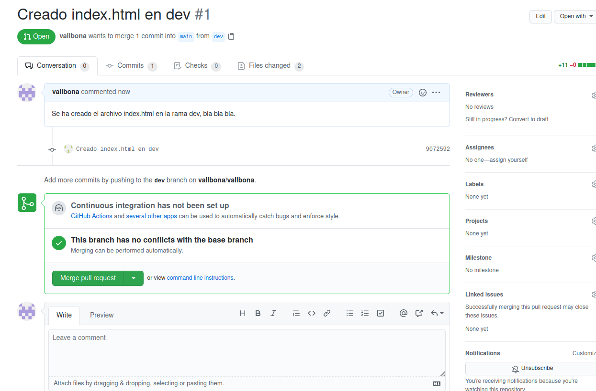
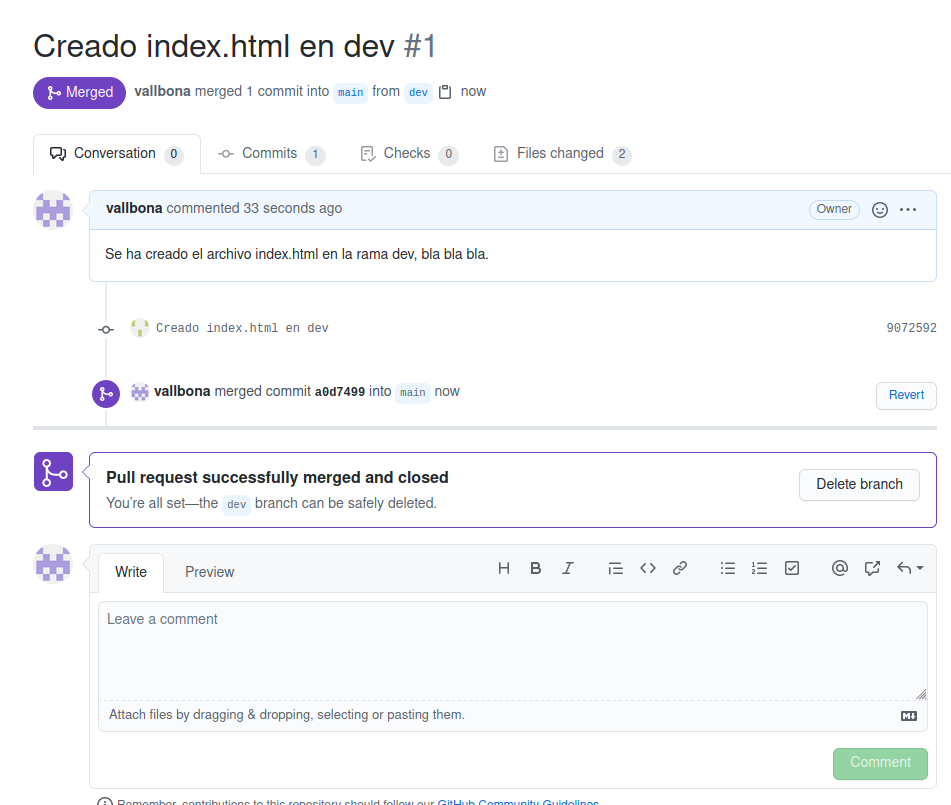
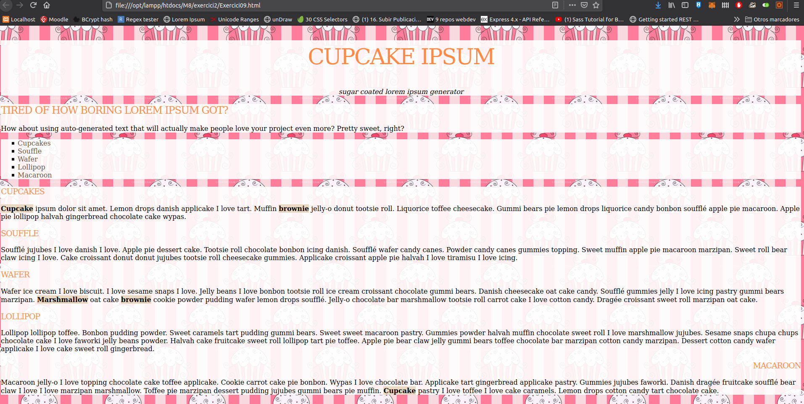
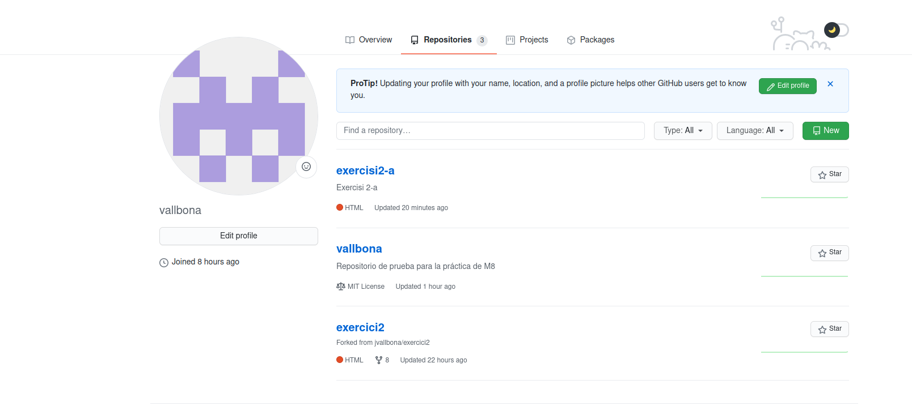
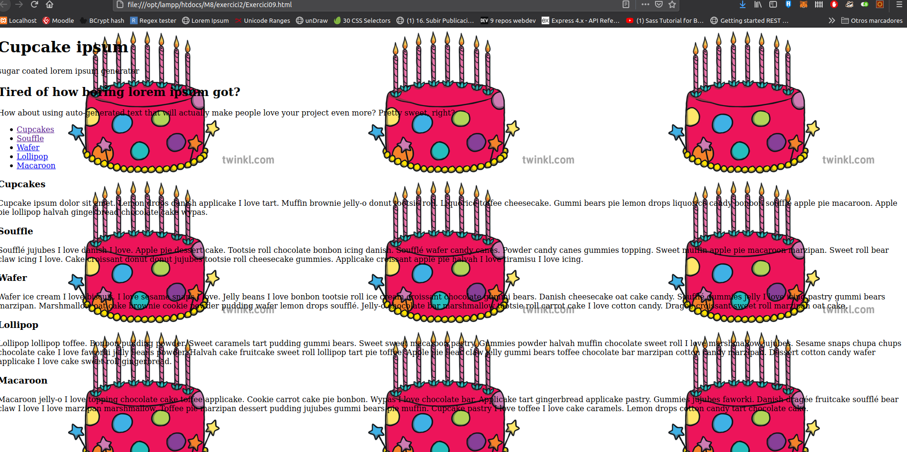
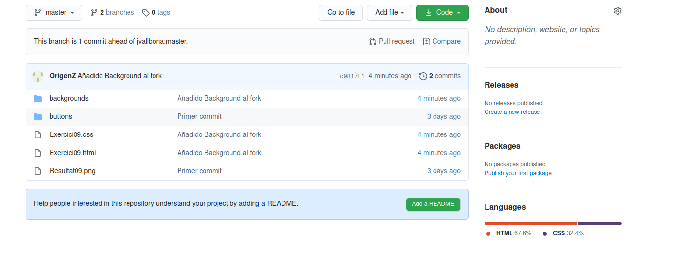

> ### 1- Abans de crear el nostre primer repositori, haurem de configurar el nostre compte deGitHub amb una clau SSH per tal de poder-nos-hi connectar des del nostre ordinador.Seguiu el tutorial de la  pàgina web de GitHub  on indica com crear una clau SSH i eltutorial on explica com afegir la clau a GitHub. Inclou captures de pantalla del terminalon has creat el certificat i de la web de GitHub amb el certificat configurat. 
``Por terminal``

``En Github``

<br/>
<br/>

> ### 2- Crea   un   nou   repositori   a   GitHub   amb   el   nom   «vallbona».   Inclou   una   captura   depantalla on aparegui el nou repositori. 

``Repositorio "Vallbona" en mi cuenta "Vallbona"``


<br/>
<br/>

> ### 3- Crea un repositori «vallbona» en el teu ordinador. Crea una branca «master» amb unfitxer «readme.md» dins. Fes-ne commit i puja el repositori a GitHub. Indica les comandes que has utilitzat. 

```
$git init vallbona
$cd vallbona
$git checkout -b main
$touch README.md
$git add .
$git commit -m "readme.md + img"
$git remote add origin git@github.com:vallbona/vallbona.git
$git pull --allow-unrelated-histories origin main
$git push -u origin main
```

<br/>

> ### 4- Crea   una   branca   anomenada   «dev»   i   actualitza   el   repostori   amb   GitHub.   Indica   la comanda utilitzada. 

```
$git checkout -b dev
$git push -u origin dev

```

<br/>

> ### 5- Crea un fitxer anomenat «index.html» i actualitza el repositori amb GitHub. Indica lescomandes utilitzades. 

```
$touch index.html
$git add .
$git commit -m "Creado index.html en dev"
$git push origin dev

```

<br/>

> ### 6- Crea   el   pull   request   amb   un   comentari   indicant   els   canvis   que   has   realitzat   en   elcommmit que has fet. Adjunta una captura de pantalla un cop enviat el «pull request». 


<br/>

> ### 7- Accepta el pull request i realitza el merge amb «master». Adjunta captura de pantallaon es vegi que has realitzat el merge. 


<br/>

> ### 9- Clona   el   repositori   «git@github.com:jvallbona/exercici2.git».   Crea   una   branca anomenada «solucio». Indica la comanda que has utilitzat. 

```
$git clone git@github.com:jvallbona/exercici2.git
$cd exercisi2
$git checkout -b solucio

```
<br/>

> ### 10- Realitza   en   la  branca   el  que   demana   el  fitxer   «Exercici09.css»   per   tal  que   el  fitxerHTML quedi com la imatge «Resultat09.png». Adjunta una imatge a pantalla completa del teu ordinador amb un navegador visualitzant el fitxer «Exercici09.html». 


<br/>

> ### 11- Puja   el   resultat   en  un   repositori   de   la   teva   propietat.  Adjunta   el   link   per   a   poder-loclonar. 

``Creamos el repositorio exercisi2 en Github cambiamos el origin y subimos los cambios``
```
$git remote set-url origin git@github.com:vallbona/exercisi2.git
$git add .
$git commit -m "Ejercicio resuelto"
$git checkout -b solucio
$git checkout master
$git merge solucio
$git push -u origin master

```
``Link para clonar: git@github.com:vallbona/exercisi2.git``
<br/>

> ### 12- Realitza un «fork» del repositori del repositori «git@github.com:jvallbona/exercici2.git».Què ha passat? Adjunta una captura de pantalla del teu repositori. 


<br/>

> ### 13- Crea   una   branca   anomenada   «dev»   i   situat   en   ella.   Canvia   la   imatge   del   fons   de pantalla per aquesta:https://images.twinkl.co.uk/tr/image/upload/illustation/Birthday-Cake-.pngAdjunta una captura de pantalla del navegador amb els canvis realitzats. 

``He tenido que cambiarle el nombre al repo original ya que se llamaba igual que el repo a forkear, una vez hecho el fork hay que clonarlo``
```
$git clone git@github.com:vallbona/exercici2.git
$cd exercisi2
$git checkout -b dev

```


<br/>

> ### 14- Puja els canvis al repositori de GitHub. Indica la comanda. Fes una captura de pantalla del   pull   request   que   s’ha   creat.   En   quin   repositori   s’està   demanant   fer   el   pull   a «master»? Escriu el  teu  nom en els comentaris  del «pull request»  i fes  clic al  botó«Create pull request». 

```
$git add .
$git commit -m "blablabla"
$git checkout master
$git merge dev
$git push -u origin master
```

``Cuando he hecho el push: $git push -u origin master me lo ha subido automáticamente, no me ha aparecido nada de push ni nada, estaría bien que estos ejercicios fuesen mas informativos, desde mi punto de vista han sido un poco caóticos y no se si realmente he hecho las cosas bien, ya que no hay guía.``
<br/>