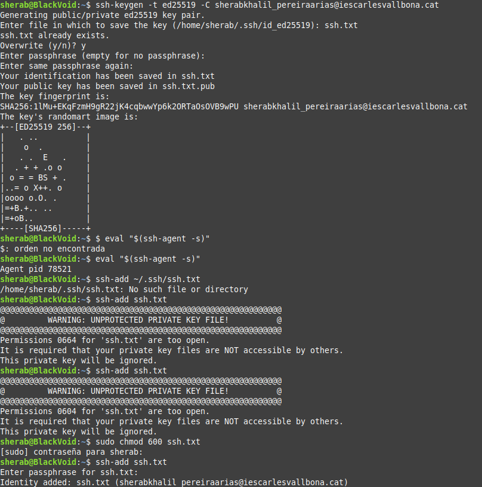
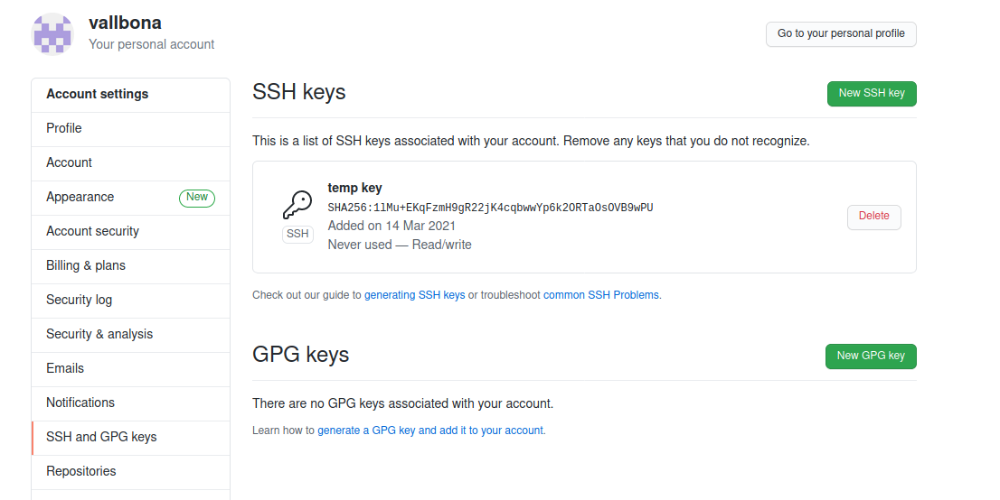
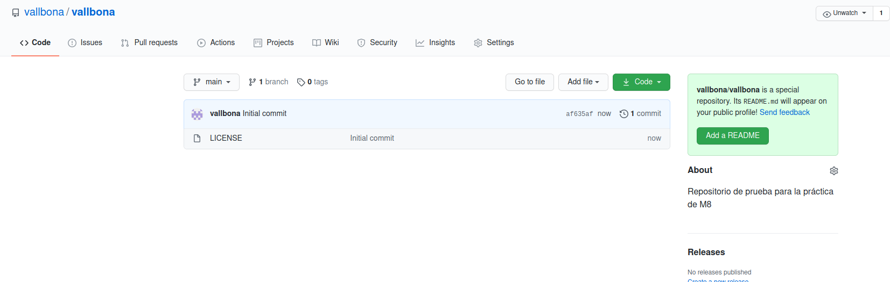

> ### 1- Abans de crear el nostre primer repositori, haurem de configurar el nostre compte deGitHub amb una clau SSH per tal de poder-nos-hi connectar des del nostre ordinador.Seguiu el tutorial de la  pàgina web de GitHub  on indica com crear una clau SSH i eltutorial on explica com afegir la clau a GitHub. Inclou captures de pantalla del terminalon has creat el certificat i de la web de GitHub amb el certificat configurat. 
``Por terminal``

``En Github``

<br/>
<br/>

> ### 2- Crea   un   nou   repositori   a   GitHub   amb   el   nom   «vallbona».   Inclou   una   captura   depantalla on aparegui el nou repositori. 

``Repositorio "Vallbona" en mi cuenta "Vallbona"``


<br/>
<br/>

> ### 3- Crea un repositori «vallbona» en el teu ordinador. Crea una branca «master» amb unfitxer «readme.md» dins. Fes-ne commit i puja el repositori a GitHub. Indica les comandes que has utilitzat. 

```
$git init vallbona
$cd vallbona
$git checkout -b main
$touch README.md
$git add .
$git commit -m "readme.md + img"
$git remote add origin git@github.com:vallbona/vallbona.git
$git push origin main
```

<br/>